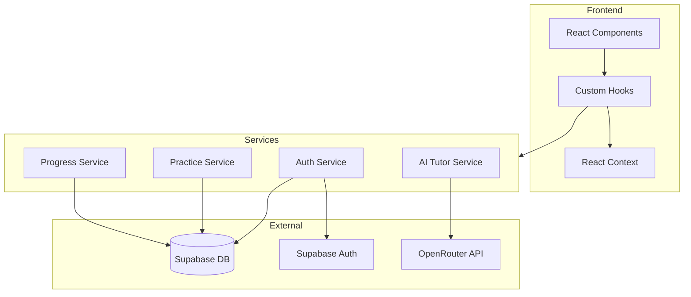

# Design Document: Beta-Ready Improvements

## Overview

This design addresses four critical issues in ShikshanAI to make it beta-ready:
1. Replace random progress values with real calculated progress from database records
2. Connect AI Tutor to OpenRouter API with context-aware, curriculum-grounded responses
3. Implement proper practice question management with attempt tracking and smart ordering
4. Add optional user authentication with data sync across devices

## Architecture



## Components and Interfaces

### 1. Progress Service

```typescript
// src/services/progressService.ts
interface TopicProgress {
  topicId: string;
  completedAt: string;
  score?: number;
}

interface SubjectProgress {
  subjectId: string;
  completedTopics: number;
  totalTopics: number;
  percentage: number;
}

interface ProgressService {
  markTopicComplete(studentId: string, topicId: string, score?: number): Promise<void>;
  getSubjectProgress(studentId: string, subjectId: string): Promise<SubjectProgress>;
  getAllProgress(studentId: string): Promise<SubjectProgress[]>;
  resetProgress(studentId: string): Promise<void>;
}
```

### 2. AI Tutor Service

```typescript
// src/services/aiTutorService.ts
interface ChatMessage {
  role: 'system' | 'user' | 'assistant';
  content: string;
}

interface StudentContext {
  gradeName: string;
  subjectName: string;
  chapterName?: string;
  topicName?: string;
}

interface AITutorService {
  sendMessage(
    messages: ChatMessage[],
    context: StudentContext
  ): Promise<string>;
  
  buildSystemPrompt(context: StudentContext): string;
}

// OpenRouter API format
interface OpenRouterRequest {
  model: string;
  messages: ChatMessage[];
  temperature?: number;
  max_tokens?: number;
}

interface OpenRouterResponse {
  choices: Array<{
    message: {
      role: string;
      content: string;
    };
  }>;
}
```

### 3. Practice Service

```typescript
// src/services/practiceService.ts
interface QuestionAttempt {
  questionId: string;
  studentId: string;
  selectedAnswer: string;
  isCorrect: boolean;
  attemptedAt: string;
}

interface PracticeStats {
  totalQuestions: number;
  attempted: number;
  correct: number;
  incorrect: number;
  unattempted: number;
}

interface PracticeService {
  getQuestionsForTopic(
    topicId: string, 
    studentId: string
  ): Promise<Question[]>; // Ordered by priority
  
  recordAttempt(attempt: QuestionAttempt): Promise<void>;
  
  getStats(topicId: string, studentId: string): Promise<PracticeStats>;
}
```

### 4. Auth Service

```typescript
// src/services/authService.ts
interface AuthService {
  signUp(email: string, password: string): Promise<User>;
  signIn(email: string, password: string): Promise<User>;
  signOut(): Promise<void>;
  getCurrentUser(): User | null;
  
  linkDeviceToUser(deviceId: string, userId: string): Promise<void>;
  syncUserData(userId: string): Promise<void>;
  mergeAnonymousData(deviceId: string, userId: string): Promise<void>;
}
```

## Data Models

### Database Schema Updates

```sql
-- Track topic completion progress
CREATE TABLE IF NOT EXISTS student_topic_progress (
  id UUID PRIMARY KEY DEFAULT gen_random_uuid(),
  student_id UUID REFERENCES student_profiles(id) ON DELETE CASCADE,
  topic_id UUID REFERENCES topics(id) ON DELETE CASCADE,
  completed_at TIMESTAMPTZ DEFAULT NOW(),
  score INTEGER,
  UNIQUE(student_id, topic_id)
);

-- Track question attempts
CREATE TABLE IF NOT EXISTS question_attempts (
  id UUID PRIMARY KEY DEFAULT gen_random_uuid(),
  student_id UUID REFERENCES student_profiles(id) ON DELETE CASCADE,
  question_id UUID REFERENCES practice_questions(id) ON DELETE CASCADE,
  selected_answer TEXT NOT NULL,
  is_correct BOOLEAN NOT NULL,
  attempted_at TIMESTAMPTZ DEFAULT NOW()
);

-- Add user_id to student_profiles for auth linking
ALTER TABLE student_profiles 
ADD COLUMN IF NOT EXISTS user_id UUID REFERENCES auth.users(id),
ADD COLUMN IF NOT EXISTS session_count INTEGER DEFAULT 0;

-- Index for efficient queries
CREATE INDEX IF NOT EXISTS idx_topic_progress_student ON student_topic_progress(student_id);
CREATE INDEX IF NOT EXISTS idx_question_attempts_student ON question_attempts(student_id);
CREATE INDEX IF NOT EXISTS idx_question_attempts_question ON question_attempts(question_id);
```

## Correctness Properties

*A property is a characteristic or behavior that should hold true across all valid executions of a system-essentially, a formal statement about what the system should do. Properties serve as the bridge between human-readable specifications and machine-verifiable correctness guarantees.*

### Property 1: Progress Calculation Accuracy
*For any* student with N completed topics out of M total topics in a subject, the calculated progress percentage SHALL equal floor((N / M) × 100).
**Validates: Requirements 1.2**

### Property 2: Progress Reset Completeness
*For any* student who resets their profile, querying their progress for any subject SHALL return 0% with 0 completed topics.
**Validates: Requirements 1.3**

### Property 3: Progress Determinism
*For any* student with a fixed set of completed topics, calling getSubjectProgress multiple times SHALL return identical results.
**Validates: Requirements 1.5**

### Property 4: Chat Message Serialization Round-Trip
*For any* valid array of chat messages, serializing to OpenRouter format and parsing the response SHALL preserve message structure and content.
**Validates: Requirements 2.7, 2.8**

### Property 5: AI Context Inclusion
*For any* student context (grade, subject, chapter), the generated system prompt SHALL contain all three context fields.
**Validates: Requirements 2.2**

### Property 6: Question Filtering by Topic
*For any* topic ID, all questions returned by getQuestionsForTopic SHALL have that topic_id.
**Validates: Requirements 3.1**

### Property 7: Attempt Recording Persistence
*For any* question attempt recorded, querying attempts for that student and question SHALL return the recorded data.
**Validates: Requirements 3.2**

### Property 8: Question Prioritization Order
*For any* practice session, unattempted questions SHALL appear before correctly-answered questions in the returned list.
**Validates: Requirements 3.3**

### Property 9: Practice Stats Accuracy
*For any* topic and student, the sum of (correct + incorrect + unattempted) SHALL equal totalQuestions.
**Validates: Requirements 3.5**

### Property 10: Anonymous Data Storage
*For any* unauthenticated user action that creates data, the data SHALL be associated with their device_id.
**Validates: Requirements 4.1**

### Property 11: Auth Data Linking
*For any* user who authenticates, their student_profile SHALL have user_id set to their auth user ID.
**Validates: Requirements 4.2**

### Property 12: Session Count Prompt Trigger
*For any* anonymous user with session_count >= 3, the system SHALL indicate a prompt should be shown.
**Validates: Requirements 4.4**

### Property 13: Profile Auth State Display
*For any* user without a linked user_id, the profile page state SHALL indicate login options should be shown.
**Validates: Requirements 4.5**

### Property 14: Data Merge Recency
*For any* topic with progress in both anonymous and authenticated data, the merged result SHALL use the record with the most recent timestamp.
**Validates: Requirements 4.7**

## Error Handling

| Error Scenario | Handling Strategy |
|----------------|-------------------|
| OpenRouter API timeout | Show error toast, enable retry button, cache last successful response |
| OpenRouter API rate limit | Implement exponential backoff, show "Please wait" message |
| Supabase connection failure | Use cached data if available, show offline indicator |
| Auth failure | Show specific error message (invalid credentials, network error, etc.) |
| Data merge conflict | Use timestamp-based resolution, log conflicts for debugging |

## Testing Strategy

### Unit Testing
- Test progress calculation with various completion states
- Test question prioritization logic
- Test session count increment logic
- Test data merge conflict resolution

### Property-Based Testing
The project will use **fast-check** for property-based testing in TypeScript/JavaScript.

Each property-based test MUST:
- Run a minimum of 100 iterations
- Be tagged with a comment referencing the correctness property: `**Feature: beta-ready-improvements, Property {number}: {property_text}**`
- Use smart generators that constrain to valid input spaces

Property tests will cover:
- Progress calculation formula (Property 1)
- Progress reset behavior (Property 2)
- Progress determinism (Property 3)
- Message serialization round-trip (Property 4)
- Context inclusion in prompts (Property 5)
- Question filtering (Property 6)
- Attempt persistence (Property 7)
- Question ordering (Property 8)
- Stats accuracy (Property 9)
- Anonymous storage (Property 10)
- Auth linking (Property 11)
- Session prompt logic (Property 12)
- Profile auth state (Property 13)
- Merge recency (Property 14)

### Integration Testing
- Test full flow: onboarding → learning → progress update → profile display
- Test auth flow: anonymous → signup → data merge → sync on new device
- Test AI tutor: send message → receive response → display in chat
