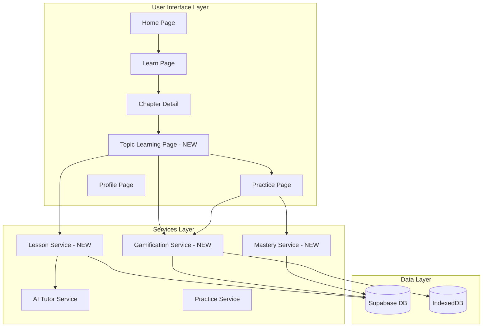

# Design Document: Learning Experience Overhaul

## Overview

This design document outlines the comprehensive overhaul of ShikshanAI's learning experience to implement a "concept-first" approach aligned with market leaders like BYJU'S, Khan Academy, and Duolingo. The overhaul introduces AI-powered concept teaching, gamification mechanics (XP, streaks, badges), mastery tracking, and an improved learning flow.

## Architecture



## Components and Interfaces

### New Pages

#### TopicLearn Page (`src/pages/TopicLearn.tsx`)
- Displays AI-generated concept explanations
- Shows content in sections with checkpoints
- Tracks progress through sections
- Provides "Practice" and "Test" buttons after completion

### New Services

#### Lesson Service (`src/services/lessonService.ts`)
```typescript
interface LessonSection {
  id: string;
  title: string;
  content: string;
  example?: string;
  visualDescription?: string;
  checkpoint: boolean;
}

interface TopicLesson {
  topicId: string;
  topicName: string;
  sections: LessonSection[];
  generatedAt: Date;
}

// Generate lesson content using AI
async function generateLesson(topicId: string, context: LessonContext): Promise<TopicLesson>;

// Get cached lesson or generate new one
async function getLesson(topicId: string): Promise<TopicLesson>;

// Mark section as completed
async function completeSection(studentId: string, topicId: string, sectionId: string): Promise<void>;
```

#### Gamification Service (`src/services/gamificationService.ts`)
```typescript
interface StudentGamification {
  xp: number;
  level: number;
  streak: number;
  lastActivityDate: string;
  badges: Badge[];
}

interface Badge {
  id: string;
  name: string;
  description: string;
  icon: string;
  earnedAt: Date;
}

// Award XP points
function awardXP(studentId: string, amount: number, reason: string): Promise<number>;

// Update streak
function updateStreak(studentId: string): Promise<number>;

// Check and award badges
function checkBadges(studentId: string): Promise<Badge[]>;

// Get student gamification data
function getGamificationData(studentId: string): Promise<StudentGamification>;

// Calculate level from XP
function calculateLevel(xp: number): number;
```

#### Mastery Service (`src/services/masteryService.ts`)
```typescript
interface TopicMastery {
  topicId: string;
  mastery: number; // 0-100
  conceptCompleted: boolean;
  practiceAttempts: number;
  correctAnswers: number;
}

// Update mastery after concept completion
function completeConceptLearning(studentId: string, topicId: string): Promise<number>;

// Update mastery after practice
function updateMasteryFromPractice(studentId: string, topicId: string, correct: boolean): Promise<number>;

// Get mastery for topic
function getTopicMastery(studentId: string, topicId: string): Promise<TopicMastery>;

// Check if topic is mastered (>= 80%)
function isTopicMastered(mastery: number): boolean;
```

### New Components

#### XP Notification (`src/components/gamification/XPNotification.tsx`)
- Animated popup showing XP earned
- Displays reason for XP award
- Auto-dismisses after 2 seconds

#### Streak Display (`src/components/gamification/StreakDisplay.tsx`)
- Flame icon with streak count
- Animated on streak increase
- Warning state when streak at risk

#### Badge Collection (`src/components/gamification/BadgeCollection.tsx`)
- Grid of earned badges
- Locked badges shown as silhouettes
- Badge detail modal on click

#### Progress Ring (`src/components/ui/progress-ring.tsx`)
- Circular progress indicator
- Shows mastery percentage
- Color changes based on level

#### Lesson Section (`src/components/learn/LessonSection.tsx`)
- Displays section content
- Shows examples with highlighting
- Checkpoint button at end

## Data Models

### Database Schema Updates

```sql
-- Gamification table
CREATE TABLE student_gamification (
  id UUID PRIMARY KEY DEFAULT gen_random_uuid(),
  student_id UUID REFERENCES student_profiles(id) ON DELETE CASCADE,
  xp INTEGER DEFAULT 0,
  level INTEGER DEFAULT 1,
  streak INTEGER DEFAULT 0,
  last_activity_date DATE,
  daily_goal_minutes INTEGER DEFAULT 30,
  created_at TIMESTAMPTZ DEFAULT NOW(),
  updated_at TIMESTAMPTZ DEFAULT NOW(),
  UNIQUE(student_id)
);

-- Badges table
CREATE TABLE badges (
  id UUID PRIMARY KEY DEFAULT gen_random_uuid(),
  name VARCHAR(100) NOT NULL,
  description TEXT,
  icon VARCHAR(50),
  criteria_type VARCHAR(50), -- 'xp', 'streak', 'mastery', 'completion'
  criteria_value INTEGER,
  created_at TIMESTAMPTZ DEFAULT NOW()
);

-- Student badges (earned)
CREATE TABLE student_badges (
  id UUID PRIMARY KEY DEFAULT gen_random_uuid(),
  student_id UUID REFERENCES student_profiles(id) ON DELETE CASCADE,
  badge_id UUID REFERENCES badges(id) ON DELETE CASCADE,
  earned_at TIMESTAMPTZ DEFAULT NOW(),
  UNIQUE(student_id, badge_id)
);

-- Topic learning progress
CREATE TABLE student_topic_learning (
  id UUID PRIMARY KEY DEFAULT gen_random_uuid(),
  student_id UUID REFERENCES student_profiles(id) ON DELETE CASCADE,
  topic_id UUID REFERENCES topics(id) ON DELETE CASCADE,
  sections_completed INTEGER DEFAULT 0,
  total_sections INTEGER,
  concept_completed BOOLEAN DEFAULT FALSE,
  completed_at TIMESTAMPTZ,
  created_at TIMESTAMPTZ DEFAULT NOW(),
  updated_at TIMESTAMPTZ DEFAULT NOW(),
  UNIQUE(student_id, topic_id)
);

-- XP transactions (for history)
CREATE TABLE xp_transactions (
  id UUID PRIMARY KEY DEFAULT gen_random_uuid(),
  student_id UUID REFERENCES student_profiles(id) ON DELETE CASCADE,
  amount INTEGER NOT NULL,
  reason VARCHAR(100),
  created_at TIMESTAMPTZ DEFAULT NOW()
);
```

### TypeScript Interfaces

```typescript
// Gamification types
interface StudentGamification {
  id: string;
  studentId: string;
  xp: number;
  level: number;
  streak: number;
  lastActivityDate: string | null;
  dailyGoalMinutes: number;
}

interface Badge {
  id: string;
  name: string;
  description: string;
  icon: string;
  criteriaType: 'xp' | 'streak' | 'mastery' | 'completion';
  criteriaValue: number;
}

interface StudentBadge {
  id: string;
  studentId: string;
  badgeId: string;
  earnedAt: Date;
  badge: Badge;
}

// Learning progress types
interface TopicLearningProgress {
  id: string;
  studentId: string;
  topicId: string;
  sectionsCompleted: number;
  totalSections: number;
  conceptCompleted: boolean;
  completedAt: Date | null;
}
```

## Correctness Properties

*A property is a characteristic or behavior that should hold true across all valid executions of a system-essentially, a formal statement about what the system should do. Properties serve as the bridge between human-readable specifications and machine-verifiable correctness guarantees.*

### Property 1: XP Award Consistency
*For any* learning activity completion (section, question, topic, chapter), the XP awarded SHALL match the defined amounts (10 for section, 5/10 for questions, 50 for topic, 200 for chapter) and the student's total XP SHALL increase by exactly that amount.
**Validates: Requirements 3.1, 3.2, 3.3, 3.4, 3.5**

### Property 2: Streak Increment Logic
*For any* student who completes a learning activity, if their last activity was yesterday or today, their streak SHALL increment by 1 (if yesterday) or remain unchanged (if today). If their last activity was more than 1 day ago, their streak SHALL reset to 1.
**Validates: Requirements 4.1, 4.2**

### Property 3: Streak Reset on Miss
*For any* student whose last activity date is more than 1 day before the current date, when they next complete an activity, their streak SHALL be set to 1 (not incremented from previous value).
**Validates: Requirements 4.2**

### Property 4: Badge Award Criteria
*For any* badge with defined criteria (XP threshold, streak days, mastery percentage), a student SHALL receive that badge if and only if they meet or exceed the criteria value.
**Validates: Requirements 5.1, 5.2, 5.3, 5.4**

### Property 5: Mastery Calculation Bounds
*For any* mastery update operation, the resulting mastery value SHALL be between 0 and 100 inclusive, and SHALL increase for correct answers and decrease for incorrect answers.
**Validates: Requirements 6.1, 6.2**

### Property 6: Mastery Threshold Detection
*For any* topic with mastery >= 80%, the `isTopicMastered` function SHALL return true, and for mastery < 80%, it SHALL return false.
**Validates: Requirements 6.4**

### Property 7: Level Calculation Consistency
*For any* XP value, the calculated level SHALL be deterministic and monotonically increasing (higher XP never results in lower level).
**Validates: Requirements 3.7**

### Property 8: Section Completion Progress
*For any* topic learning session, completing a section SHALL increment `sectionsCompleted` by exactly 1, and when `sectionsCompleted` equals `totalSections`, `conceptCompleted` SHALL be set to true.
**Validates: Requirements 1.4, 1.5**

### Property 9: Navigation Flow Enforcement
*For any* topic where `conceptCompleted` is false, attempting to access Practice or Test SHALL be blocked or redirected to the learning page.
**Validates: Requirements 9.3**

### Property 10: Content Generation for Empty Topics
*For any* topic without pre-existing lesson content, the lesson service SHALL generate content with 3-5 sections, each containing a title and content string.
**Validates: Requirements 2.1, 2.4, 10.1**

### Property 11: Daily Goal Progress Tracking
*For any* learning activity, the time spent SHALL be added to the daily progress, and when daily progress >= daily goal, the goal completion bonus SHALL be awarded exactly once per day.
**Validates: Requirements 8.2, 8.3**

### Property 12: Question Prioritization by Mastery
*For any* practice session, questions from topics with lower mastery SHALL appear before questions from topics with higher mastery.
**Validates: Requirements 7.1**

### Property 13: Consecutive Wrong Answer Detection
*For any* sequence of 3 consecutive wrong answers in a practice session, the system SHALL trigger a review suggestion.
**Validates: Requirements 7.4**

## Error Handling

### AI Content Generation Failures
- Fallback to cached content if available
- Display generic "Content loading..." message
- Retry with exponential backoff (3 attempts)
- Log errors for monitoring

### Network Errors
- Queue XP awards for sync when online
- Store progress locally in IndexedDB
- Show offline indicator
- Sync on reconnection

### Database Errors
- Graceful degradation - continue with local state
- Retry failed writes
- Alert user if critical data cannot be saved

## Testing Strategy

### Unit Testing
- Test all pure functions in services
- Test XP calculation logic
- Test streak logic with various date scenarios
- Test mastery calculation bounds
- Test level calculation

### Property-Based Testing
We will use **fast-check** for property-based testing in TypeScript/JavaScript.

Each correctness property will be implemented as a property-based test:
- Property 1: Generate random XP amounts and verify totals
- Property 2-3: Generate random date sequences and verify streak behavior
- Property 4: Generate random criteria and student stats, verify badge awards
- Property 5-6: Generate random mastery updates, verify bounds and thresholds
- Property 7: Generate random XP values, verify level monotonicity
- Property 8: Generate random section completions, verify progress
- Property 10: Generate random topic contexts, verify content structure

### Integration Testing
- Test full learning flow: Topic → Learn → Practice
- Test gamification across multiple sessions
- Test offline/online sync scenarios
