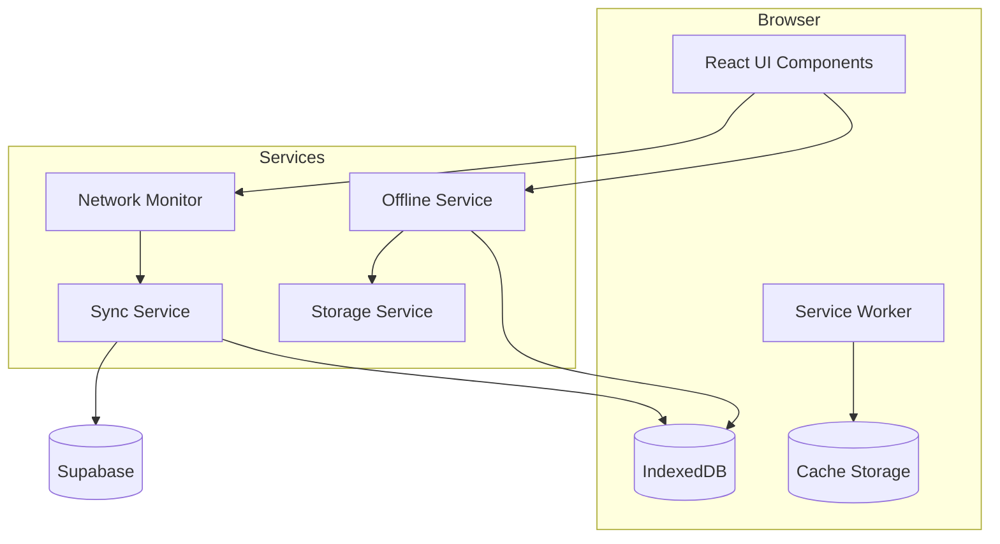

# Design Document: PWA Offline Support

## Overview

This document outlines the technical design for implementing Progressive Web App (PWA) offline support in ShikshanAI. The implementation enables students to install the app, download lesson content for offline study, track progress without connectivity, and sync data when back online. The design prioritizes low-end Android devices and spotty Indian networks.

## Architecture



### High-Level Flow

1. **Service Worker** handles static asset caching and offline fallbacks
2. **IndexedDB** stores downloaded lesson packs and pending sync data
3. **Network Monitor** detects connectivity changes and triggers sync
4. **Sync Service** reconciles local changes with server on reconnection
5. **Storage Service** manages quota and cleanup

## Components and Interfaces

### 1. Service Worker (`sw.ts`)

Handles caching strategies and offline fallbacks using Workbox.

```typescript
interface CacheConfig {
  staticAssets: string[];      // App shell files
  maxCacheSize: number;        // 50MB limit
  maxAge: number;              // Cache expiration
}

interface ServiceWorkerMessage {
  type: 'SKIP_WAITING' | 'CACHE_UPDATED' | 'SYNC_REQUIRED';
  payload?: unknown;
}
```

### 2. Offline Service (`src/services/offlineService.ts`)

Manages lesson pack downloads and offline content access.

```typescript
interface OfflineService {
  downloadLessonPack(chapterId: string): Promise<DownloadResult>;
  getLessonPack(chapterId: string): Promise<LessonPack | null>;
  isChapterDownloaded(chapterId: string): Promise<boolean>;
  deleteLessonPack(chapterId: string): Promise<void>;
  clearAllOfflineData(): Promise<void>;
  getDownloadedChapters(): Promise<DownloadedChapter[]>;
}

interface DownloadResult {
  success: boolean;
  error?: 'STORAGE_FULL' | 'NETWORK_ERROR' | 'UNKNOWN';
  bytesDownloaded?: number;
}

interface LessonPack {
  chapterId: string;
  chapterName: string;
  subjectName: string;
  topics: OfflineTopic[];
  questions: OfflineQuestion[];
  downloadedAt: number;
  sizeBytes: number;
}
```

### 3. Sync Service (`src/services/syncService.ts`)

Handles background synchronization of offline progress.

```typescript
interface SyncService {
  queueResponse(response: PendingResponse): Promise<void>;
  getPendingCount(): Promise<number>;
  syncPendingResponses(): Promise<SyncResult>;
  resolveConflict(local: PendingResponse, remote: ServerResponse): PendingResponse;
}

interface PendingResponse {
  id: string;
  questionId: string;
  answer: string;
  isCorrect: boolean;
  timestamp: number;
  synced: boolean;
}

interface SyncResult {
  synced: number;
  failed: number;
  conflicts: number;
}
```

### 4. Storage Service (`src/services/storageService.ts`)

Manages storage quota and cleanup.

```typescript
interface StorageService {
  getUsedStorage(): Promise<number>;
  getAvailableStorage(): Promise<number>;
  getLessonPackSize(chapterId: string): Promise<number>;
  evictLRUContent(targetBytes: number): Promise<void>;
  isStorageAvailable(requiredBytes: number): Promise<boolean>;
}
```

### 5. Network Monitor Hook (`src/hooks/useNetworkStatus.ts`)

React hook for network status detection.

```typescript
interface NetworkStatus {
  isOnline: boolean;
  wasOffline: boolean;  // True if was recently offline (for sync trigger)
  effectiveType: '4g' | '3g' | '2g' | 'slow-2g' | null;
}

function useNetworkStatus(): NetworkStatus;
```

### 6. UI Components

```typescript
// Offline indicator banner
interface OfflineBannerProps {
  isOffline: boolean;
  pendingSyncCount: number;
}

// Download button for chapters
interface DownloadButtonProps {
  chapterId: string;
  isDownloaded: boolean;
  onDownloadComplete: () => void;
}

// Storage management in profile
interface StorageManagerProps {
  downloadedChapters: DownloadedChapter[];
  totalUsed: number;
  onDelete: (chapterId: string) => void;
  onClearAll: () => void;
}
```

## Data Models

### IndexedDB Schema

```typescript
// Database: shikshanai-offline
// Version: 1

interface OfflineDB {
  lessonPacks: {
    key: string;  // chapterId
    value: LessonPack;
    indexes: ['downloadedAt', 'subjectId'];
  };
  
  pendingResponses: {
    key: string;  // auto-generated
    value: PendingResponse;
    indexes: ['timestamp', 'synced'];
  };
  
  offlineProgress: {
    key: string;  // `${studentId}-${topicId}`
    value: {
      topicId: string;
      attempts: number;
      correctCount: number;
      lastAttemptAt: number;
    };
  };
  
  metadata: {
    key: string;
    value: {
      lastSyncAt: number;
      visitCount: number;
      firstVisitAt: number;
    };
  };
}
```

### Lesson Pack Structure

```typescript
interface OfflineTopic {
  id: string;
  name: string;
  conceptCount: number;
  content: string;        // Markdown content
  formulas: string[];     // LaTeX formulas
  ncertPageRef: string | null;
}

interface OfflineQuestion {
  id: string;
  topicId: string;
  question: string;
  questionType: 'mcq' | 'numerical' | 'short';
  options: string[] | null;
  correctAnswer: string;
  hint: string | null;
  solution: string | null;
  ncertRef: string | null;
  difficulty: 'easy' | 'medium' | 'hard';
}

interface DownloadedChapter {
  chapterId: string;
  chapterName: string;
  subjectName: string;
  subjectIcon: string;
  topicCount: number;
  questionCount: number;
  sizeBytes: number;
  downloadedAt: number;
}
```

## Correctness Properties

*A property is a characteristic or behavior that should hold true across all valid executions of a system-essentially, a formal statement about what the system should do. Properties serve as the bridge between human-readable specifications and machine-verifiable correctness guarantees.*

### Property 1: Install prompt visit tracking
*For any* sequence of visits to the app, the install prompt should only be shown after the second visit within a 7-day window, and never before.
**Validates: Requirements 1.1**

### Property 2: Cache eviction preserves essentials under limit
*For any* cache state exceeding 50MB, after running the eviction algorithm, the total cache size should be under 50MB AND all essential app shell assets should remain cached.
**Validates: Requirements 2.4**

### Property 3: Lesson pack download round-trip
*For any* valid chapter with topics and questions, after downloading the lesson pack and then retrieving it, the retrieved content should contain all original topics and up to 20 questions with all required fields intact.
**Validates: Requirements 3.2**

### Property 4: Download progress accuracy
*For any* lesson pack download operation, the reported progress percentage should monotonically increase from 0 to 100 and accurately reflect the ratio of bytes downloaded to total bytes.
**Validates: Requirements 3.3**

### Property 5: Downloaded status indicator accuracy
*For any* chapter, the `isDownloaded` status returned by the offline service should be true if and only if a complete lesson pack exists in IndexedDB for that chapter.
**Validates: Requirements 3.4**

### Property 6: Offline content accessibility
*For any* downloaded chapter when the network is unavailable, all topics and practice questions from that chapter should be retrievable from local storage without network requests.
**Validates: Requirements 4.1, 4.2**

### Property 7: Non-downloaded content shows download message
*For any* chapter that is not downloaded, when the network is unavailable and the user attempts to access it, the system should return a "download required" state rather than content.
**Validates: Requirements 4.3**

### Property 8: Offline indicator matches network state
*For any* network state (online/offline), the offline banner visibility should be true when offline and false when online.
**Validates: Requirements 4.4, 6.2, 6.3**

### Property 9: Offline response storage round-trip
*For any* practice response submitted while offline, storing it and then retrieving pending responses should include that response with the correct timestamp and all answer data intact.
**Validates: Requirements 5.1**

### Property 10: Sync on reconnection
*For any* set of pending offline responses, when the network becomes available and sync completes successfully, all responses should be sent to the server and marked as synced.
**Validates: Requirements 5.2**

### Property 11: Conflict resolution by timestamp
*For any* two responses for the same question with different timestamps, the conflict resolution should always preserve the response with the later timestamp.
**Validates: Requirements 5.3**

### Property 12: Pending sync count accuracy
*For any* state of the pending responses queue, the displayed pending count should equal the actual number of unsynced responses in IndexedDB.
**Validates: Requirements 5.4**

### Property 13: Sync removes from pending queue
*For any* successfully synced response, after sync completion, that response should no longer appear in the pending queue (either removed or marked synced).
**Validates: Requirements 5.5**

### Property 14: Network-required features disabled when offline
*For any* feature marked as requiring network (e.g., Tutor), when offline, that feature should be in a disabled state with appropriate messaging.
**Validates: Requirements 4.5, 6.4**

### Property 15: Storage calculation accuracy
*For any* set of downloaded lesson packs, the total storage displayed should equal the sum of individual lesson pack sizes, and each pack's displayed size should match its actual IndexedDB storage.
**Validates: Requirements 7.1, 7.2**

### Property 16: Lesson pack deletion completeness
*For any* downloaded lesson pack, after deletion, querying for that chapter should return null and the storage used should decrease by the pack's size.
**Validates: Requirements 7.3**

### Property 17: Clear all preserves app shell
*For any* state with downloaded content, after clearing all offline data, all lesson packs should be removed but the app should remain functional (app shell intact).
**Validates: Requirements 7.4**

## Error Handling

### Storage Quota Exceeded
- Detect `QuotaExceededError` during IndexedDB writes
- Trigger LRU eviction of old lesson packs
- If still insufficient, notify user with storage management prompt

### Network Errors During Download
- Implement retry with exponential backoff (3 attempts)
- Save partial progress for resume capability
- Show clear error message with retry option

### Sync Failures
- Queue failed syncs for retry on next connectivity
- Implement conflict detection via timestamps
- Never lose local data - server is source of truth only after successful sync

### IndexedDB Unavailable
- Detect private browsing mode or disabled IndexedDB
- Fall back to in-memory storage for session
- Warn user that offline features are limited

## Testing Strategy

### Property-Based Testing

The implementation will use **fast-check** as the property-based testing library for TypeScript/JavaScript.

Each correctness property will be implemented as a property-based test with:
- Minimum 100 iterations per property
- Custom generators for domain objects (LessonPack, PendingResponse, etc.)
- Shrinking enabled for minimal failing examples

Test annotations will follow the format:
```typescript
// **Feature: pwa-offline-support, Property 3: Lesson pack download round-trip**
// **Validates: Requirements 3.2**
```

### Unit Tests

Unit tests will cover:
- Service method edge cases (empty inputs, null handling)
- IndexedDB wrapper operations
- Network status hook state transitions
- UI component rendering states

### Integration Tests

- Full download → offline access → sync flow
- Service worker registration and caching
- Cross-tab synchronization

### Test Environment

- Use `fake-indexeddb` for IndexedDB mocking
- Use `msw` (Mock Service Worker) for network mocking
- Test offline scenarios by controlling navigator.onLine
